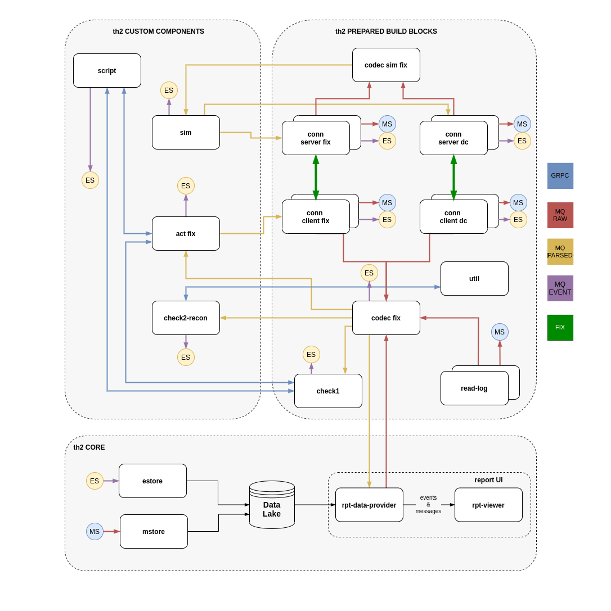

## Configuring Schema ##

Schema can be configured to be deployed to kubernetes and managed by infra manager.
Behaviour is controlled by `k8s-propagation` property in the `infra-mgr-config.yml` file.
These are the possible values for this property:

- `off`  - No synchronization will be done
- `deny` - No synchronization will be done and associated namespece will be removed from the kubernetes
- `sync` - Synchronizes repository changes with kubernetes
- `rule` - Synchronizes repository changes with kubernetes. Also monitors resource changes in kubernetes and 
         brings them back to repository state
  

## Creating new namespace
1) Create a new branch based on master
2) Make all the wanted changes in the `CRs`.
3) If you want to add new component make sure to include it in `links-live.yml`, `dictionary-links.yml`, `codec-links.yml` (if needed) link files are placed in `links` directory.
4) If you are going to have several namespaces together, make sure to assign each component in each namespace with unique `nodePort`. (nodePorts must be unique across the namespaces too)components that require `nodePort` are: `rpt-data-provider`, `rpt-data-viewer`, `act`, `check1`. Following ports are reserved by th2-infra: `rmq ampq protocol: 32000`, `cassandra cql: 32010`, `ingress: 30000`.
5) Make sure that `k8s-propagation` property in `infra-mgr-config.yml` file is set to `sync` (only branches that have this property set to `sync` or `rule` will be deployed by infra manager).
6) commit all new branch to `git`. (After committing new namespace will be created automatically, it might take 20-40 seconds)

## Restarting existing namespace
There are two methods to restart the namespace

**Repository only method**
1) set `k8s-propagation` property to `deny` in `infra-mgr-config.yml`. Namespace will be deleted by infra manager during 30-60 secs.
2) set `k8s-propagation` property to `sync` or `rule` in `infra-mgr-config.yml`. Schema will be deployed by infra manager during 30-60 secs.

**Involving kubernetes**
1) set `k8s-propagation` property in `infra-mgr-config.yml` to `rule` and commit this change.
2) delete existing namespace using `kubectl delete namespace NAMESPACE_NAME` command. Schema will be redeployed automatically after 30-60 secs

## Restarting single component
in order to restart single component just delete `pod` of that specific component using `kubectl delete pod POD_NAME -n POD_NAMESPACE` command or using kubernetes dashboard (if you have necessary privileges). After deleting, `pod` will be recreated automatically.  

## Environment schema
