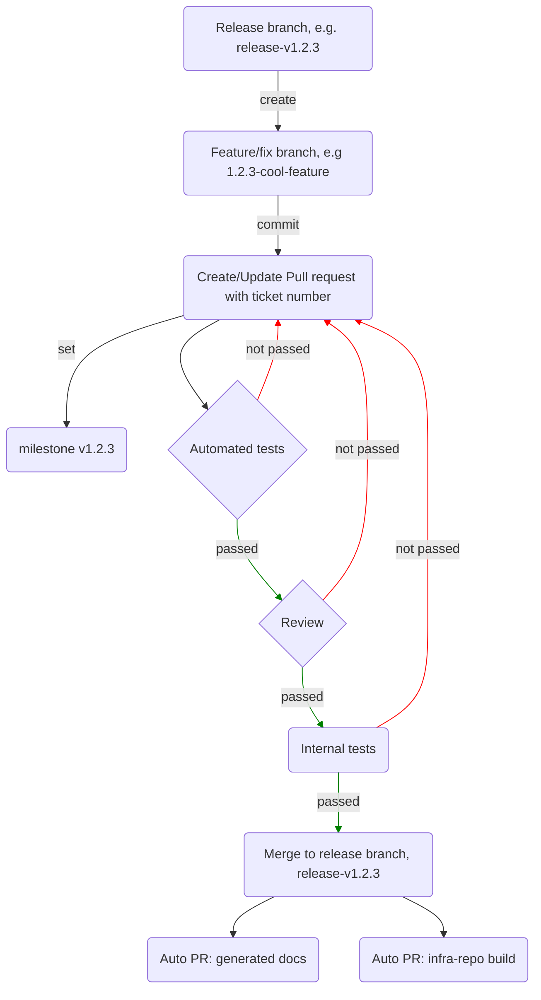
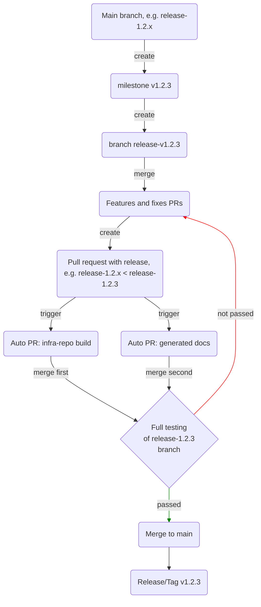

# Process Diagram

## Feature or fix cycle

```mermaid
flowchart TB
    init(Release branch, e.g. release-v1.2.3) --> |create| branch
    branch(Feature/fix branch, e.g 1.2.3-cool-feature) -->|commit| pr(Create/Update Pull request with ticket number)
    pr -->|set| milestone(milestone v1.2.3)
    pr --> tests
    tests{Automated tests} --> |not passed| pr
    tests{Automated tests} --> |passed| review
    review{Review} --> |not passed| pr
    review{Review} --> |passed| e2e(Internal tests)
    e2e --> |not passed| pr
    e2e --> |passed| merge(Merge to release branch, release-v1.2.3)
    
    linkStyle 5 stroke:green
    linkStyle 7 stroke:green
    linkStyle 9 stroke:green
    
    linkStyle 4 stroke:red
    linkStyle 6 stroke:red
    linkStyle 8 stroke:red
    
    merge --> buildDocs(Auto PR: generated docs)
    merge --> buildInfraRepo(Auto PR: infra-repo build)
```

## Release cycle

```mermaid
flowchart TB
    init(Main branch, e.g. release-1.2.x) -->|create| milestone(milestone v1.2.3)
    milestone -->|create| branch(branch release-v1.2.3)
    branch -->|merge| features(Features and fixes PRs)
    features -->|create| pr(Pull request with release, e.g. release-1.2.x < release-1.2.3)
    pr -->|trigger| buildDocs(Auto PR: generated docs)
    pr -->|trigger| buildInfraRepo
    buildInfraRepo(Auto PR: infra-repo build) -->|merge first| e2e{Full testing\n of release-1.2.3\n branch}
    buildDocs(Auto PR: generated docs) -->|merge second| e2e
    e2e -->|not passed| features
    e2e -->|passed| mergeRelease(Merge to main)
    mergeRelease --> tag(Release/Tag v1.2.3)
    
    linkStyle 8 stroke:red
    linkStyle 9 stroke:green
```
