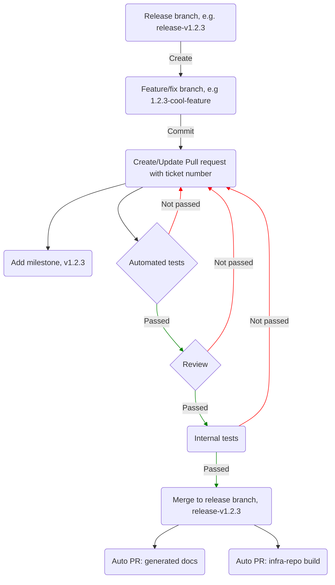
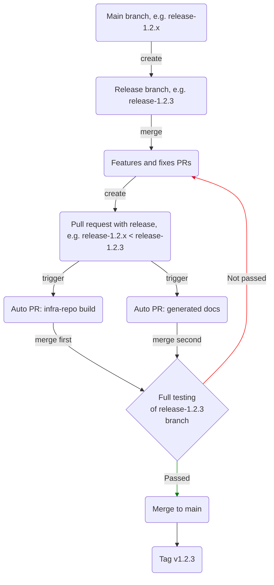

# Process Diagram

## Cycle of a particular feature or fix development

```mermaid
flowchart TB
    init(Release branch, e.g. release-v1.2.3) --> |Create| branch
    branch(Feature/fix branch, e.g 1.2.3-cool-feature) -->|Commit| pr(Create/Update Pull request with ticket number)
    pr --> milestone(Add milestone, v1.2.3)
    pr --> tests
    tests{Automated tests} --> |Not passed| pr
    tests{Automated tests} --> |Passed| review
    review{Review} --> |Not passed| pr
    review{Review} --> |Passed| e2e(Internal tests)
    e2e --> |Not passed| pr
    e2e --> |Passed| merge(Merge to release branch, release-v1.2.3)
    
    linkStyle 5 stroke:green
    linkStyle 7 stroke:green
    linkStyle 9 stroke:green
    
    linkStyle 4 stroke:red
    linkStyle 6 stroke:red
    linkStyle 8 stroke:red
    
    merge --> buildDocs(Auto PR: generated docs)
    merge --> buildInfraRepo(Auto PR: infra-repo build)
```

## Cycle of a particular release development

```mermaid
flowchart TB
    init(Main branch, e.g. release-1.2.x) -->|create| branch
    branch(Release branch, e.g. release-1.2.3) -->|merge| features(Features and fixes PRs)
    features -->|create| pr(Pull request with release, e.g. release-1.2.x < release-1.2.3)
    
    pr -->|trigger| buildDocs(Auto PR: generated docs)
    pr -->|trigger| buildInfraRepo
    buildInfraRepo(Auto PR: infra-repo build) -->|merge first| e2e{Full testing\n of release-1.2.3\n branch}
    buildDocs(Auto PR: generated docs) -->|merge second| e2e
    e2e -->|Not passed| features
    e2e -->|Passed| mergeRelease(Merge to main)
    mergeRelease --> tag(Tag v1.2.3)
    
    linkStyle 7 stroke:red
    linkStyle 8 stroke:green
```
