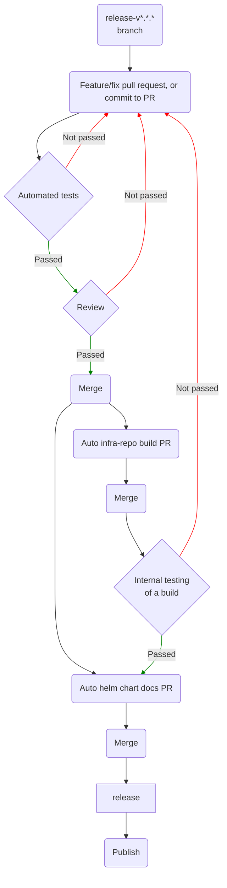

# Process Diagram

From top to bottom

```mermaid
flowchart TB
    branch(release-v*.*.*<br/>branch) --> pr(Feature/fix pull request, or commit to PR)
    pr --> tests
    tests{Automated tests} --> |Passed| review
    tests{Automated tests} --> |Not passed| pr
    review{Review} --> |Passed| merge(Merge)
    review{Review} --> |Not passed| pr
    merge --> buildDocs(Auto helm chart docs PR)
    buildDocs --> mergeDocs(Merge)
    mergeDocs --> release
    merge --> buildInfraRepo(Auto infra-repo build PR)
    buildInfraRepo(Auto infra-repo build PR) --> mergeInfraRepo(Merge)
    mergeInfraRepo --> internal{Internal testing<br/>of a build}
    internal --> |Passed| buildDocs
    internal --> |Not passed| pr
    release --> publish(Publish)
    
    linkStyle 2 stroke:green
    linkStyle 4 stroke:green
    linkStyle 12 stroke:green
    
    linkStyle 3 stroke:red
    linkStyle 5 stroke:red
    linkStyle 13 stroke:red

```
